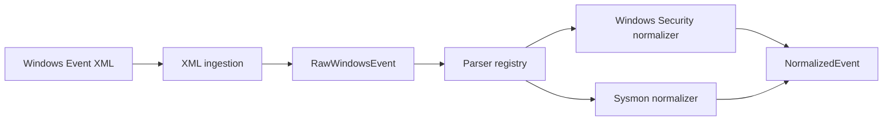

# Event Processing Architecture

## Status and boundary

The v0.2.0 event-processing implementation is on `main`, but v0.2.0 has not
yet been released. It transforms one supported Windows Event XML record into a
validated `NormalizedEvent`. The boundary ends there: detection is planned for
v0.3.0, not part of the current runtime. The original requirements are recorded
in the [event-processing scope](../event-processing-scope.md); this document
describes the implementation as it exists now.

## Implemented flow

Windows Event XML → `RawWindowsEvent` → parser registry → source normalizer →
`NormalizedEvent`.



The public `normalize_windows_event_xml(xml)` function composes these steps.
The stages do not perform detection, enrichment, persistence, or API work.

## XML ingestion and the raw envelope

`parse_windows_event_xml(xml)` accepts exactly one namespaced Windows Event XML
record using the `http://schemas.microsoft.com/win/2004/08/events/event`
namespace. It extracts common metadata only from `System` and preserves named
`EventData/Data` text as source-shaped strings. Missing `EventData` yields an
empty mapping; unknown named fields are retained. The timestamp must include a
time zone and is converted to UTC. Invalid XML or raw structure fails with a
controlled ingestion error rather than a partial event.

| `RawWindowsEvent` field | Contract | XML source |
| --- | --- | --- |
| `provider` | Required non-empty string | `System/Provider/@Name` |
| `event_id` | Required positive integer | `System/EventID` |
| `channel` | Required non-empty string | `System/Channel` |
| `timestamp` | Required time-zone-aware datetime, normalized to UTC | `System/TimeCreated/@SystemTime` |
| `computer` | Required non-empty string | `System/Computer` |
| `record_id` | Optional non-negative integer; `None` when absent | `System/EventRecordID` |
| `event_data` | Mapping of named source strings; empty when absent | `EventData/Data/@Name` and text |

The raw envelope is pre-normalization. Ingestion does not derive `EventSource`
or category, parse binary `.evtx`, subscribe to live Windows Event Logs, ingest
from SIEM/EDR/network services, or make detection decisions.

## Registry dispatch and supported identities

The read-only registry explicitly maps `(provider, event_id)` to a source
normalizer. There is no plugin discovery, reflection, or fallback route.
Unknown providers and positive but unsupported Event IDs fail explicitly.
Channel validation belongs to the selected source normalizer, not the registry.

| Source | Provider | Channel | Event ID | Meaning | Category |
| --- | --- | --- | ---: | --- | --- |
| Windows Security | `Microsoft-Windows-Security-Auditing` | `Security` | 4624 | Successful Logon | `authentication` |
| Windows Security | `Microsoft-Windows-Security-Auditing` | `Security` | 4625 | Failed Logon | `authentication` |
| Windows Security | `Microsoft-Windows-Security-Auditing` | `Security` | 4688 | Process Creation | `process` |
| Sysmon | `Microsoft-Windows-Sysmon` | `Microsoft-Windows-Sysmon/Operational` | 1 | Process Creation | `process` |
| Sysmon | `Microsoft-Windows-Sysmon` | `Microsoft-Windows-Sysmon/Operational` | 3 | Network Connection | `network` |
| Sysmon | `Microsoft-Windows-Sysmon` | `Microsoft-Windows-Sysmon/Operational` | 11 | File Create | `file` |
| Sysmon | `Microsoft-Windows-Sysmon` | `Microsoft-Windows-Sysmon/Operational` | 22 | DNS Query | `dns` |

The registry key deliberately omits channel. For a registered provider and ID,
the source normalizer still rejects an incorrect channel with
`UnsupportedEventError`.

## Normalized domain contract

`NormalizedEvent` carries the common metadata from the raw event: `provider`,
`event_id`, `channel`, `timestamp`, `computer`, and optional `record_id`. It also
requires `source` (`windows_security` or `sysmon`), `category`, and a matching
typed `context`. `source_data` defaults to an empty mapping. Category/context
agreement is validated by the domain model. The five implemented categories
are `authentication`, `process`, `network`, `file`, and `dns`.

| Context | Required fields | Optional fields |
| --- | --- | --- |
| `AuthenticationContext` | `outcome` (`success` or `failure`) | `user`, `domain`, `logon_type`, `source_ip`, `source_port`, `workstation` |
| `ProcessContext` | non-empty `image` | `process_id`, `command_line`, `parent_process_id`, `parent_image`, `user` |
| `NetworkContext` | typed `source_ip`, `source_port`, `destination_ip`, `destination_port` | `protocol`, `process_id`, `process_image` |
| `FileContext` | non-empty `target_path` | `process_id`, `process_image` |
| `DnsContext` | non-empty `query_name` | `query_status`, `query_results`, `process_id`, `process_image` |

Where present, process IDs and logon type are non-negative integers; ports are
integers from 0 through 65535; IP fields are validated IP addresses. A field
being optional in the shared context does not make it optional for every source
event. In particular, Security 4688 needs `NewProcessName` and `NewProcessId`;
Sysmon 1 needs `Image` and `ProcessId`; Sysmon 3 needs both IPs and ports;
Sysmon 11 needs `TargetFilename`; and Sysmon 22 needs `QueryName`.

Absent optional source values remain `None`. For consumed optional text,
empty, whitespace-only, and `-` values are treated as absent; other values are
trimmed. Required text rejects those missing/sentinel forms. Numeric conversion
is deterministic: Security process identifiers accept decimal and `0x`-prefixed
hexadecimal values, while Sysmon process identifiers are decimal. Invalid
present numbers are errors, not silently missing values. Typed IP and port
validation occurs when building the normalized context.

For each supported event, `source_data` contains precisely the original
`EventData` entries not consumed into its typed context. Retained values are
not stripped or otherwise rewritten, and unknown named fields remain
available. Consumed fields are not copied there again. The typed context is
authoritative for shared semantics; `source_data` is useful source-specific
context, not a copy of the full XML and not a way around validation.

## Controlled failures

| Error | Boundary and meaning |
| --- | --- |
| `MalformedEventXmlError` | Ingestion: syntactically malformed XML. |
| `InvalidRawEventError` | Ingestion: XML/raw metadata cannot form `RawWindowsEvent`, such as missing required `System` metadata, invalid Event ID representation or timestamp, or malformed `EventData`. |
| `UnsupportedEventError` | Registry or source normalizer: valid raw identity is outside the registered provider/ID set or violates the selected source/channel identity. |
| `InvalidNormalizedEventError` | Source normalizer: supported identity has missing/invalid required context values, invalid process IDs, typed IPs, or ports. |

The first two derive from `WindowsEventIngestionError`; the latter two derive
from `EventNormalizationError`. The public pipeline propagates these controlled
errors instead of returning partially normalized events or translating them
into HTTP responses.

## Synthetic examples

These compact excerpts come from the committed public-safe fixtures; they are
not production telemetry. Each normalized shape omits unchanged common
metadata for brevity.

### Security 4624: successful logon

```text
System: Provider=Microsoft-Windows-Security-Auditing, EventID=4624, Channel=Security
EventData: TargetUserName=lab.user, LogonType=3, IpAddress=192.0.2.10
```

```text
source=windows_security, category=authentication
context=AuthenticationContext(outcome=success, user=lab.user,
                              logon_type=3, source_ip=192.0.2.10)
```

The source normalizer derives the successful outcome from Event ID 4624 and
types the logon and IP values. Unconsumed fields such as `SubjectLogonId` remain
in `source_data` with their original strings.

### Security 4688: process creation

```text
System: Provider=Microsoft-Windows-Security-Auditing, EventID=4688, Channel=Security
EventData: NewProcessName=C:\Windows\System32\cmd.exe, NewProcessId=0x1f40,
           ProcessId=0x1388
```

```text
source=windows_security, category=process
context=ProcessContext(image=C:\Windows\System32\cmd.exe, process_id=8000,
                       parent_process_id=5000)
```

The normalizer converts the Windows hexadecimal process identifiers to
non-negative integers; unconsumed fields such as `TokenElevationType` stay in
`source_data`.

### Sysmon 3: network connection

```text
System: Provider=Microsoft-Windows-Sysmon, EventID=3,
        Channel=Microsoft-Windows-Sysmon/Operational
EventData: SourceIp=192.0.2.10, SourcePort=53000,
           DestinationIp=203.0.113.53, DestinationPort=53, Protocol=udp
```

```text
source=sysmon, category=network
context=NetworkContext(source_ip=192.0.2.10, source_port=53000,
                       destination_ip=203.0.113.53, destination_port=53,
                       protocol=udp)
```

The IP addresses and ports become typed context values. Sysmon-only fields
without matching context fields, such as `Initiated`, remain in `source_data`.

## Responsibilities and test strategy

| Component | Responsibility | Does not do |
| --- | --- | --- |
| XML ingestion | Parse one namespaced XML event and validate raw structure | Binary `.evtx` or live collection |
| `RawWindowsEvent` | Typed source-shaped envelope | Source routing or detection |
| Parser registry | Explicit provider/Event ID dispatch | Channel validation or plugin discovery |
| Windows Security normalizer | Map 4624, 4625, 4688 to typed contexts | Sysmon mapping or detection |
| Sysmon normalizer | Map 1, 3, 11, 22 to typed contexts | Security mapping or detection |
| `NormalizedEvent` models | Validate common metadata and category/context agreement | Alert creation or persistence |
| Integration tests | Exercise XML through the public normalization pipeline | External services or production telemetry |

Seven hand-authored XML fixtures under `tests/fixtures/windows/` cover the
supported identities. They use fictional/example names and documentation IP
ranges, consistent with [SECURITY.md](../../SECURITY.md). Focused parser and
model tests live under `backend/tests/`; cross-component tests live under
`tests/integration/`. The tests are deterministic and offline, with no network,
database, SIEM, EDR, or other external service required.

## Current limits and next boundary

This event-processing layer does not implement binary `.evtx` parsing, live or
production event collection, arbitrary providers or Event IDs, detection rules
or a Detection Engine, alert generation or management, triage, investigation,
IOC or MITRE ATT&CK runtime enrichment, persistence/databases, FastAPI/API
endpoints, a web UI, message brokers, or background workers. These are
milestone boundaries, not unhandled branches of the implemented pipeline.

The v0.2.0 output is `NormalizedEvent`. A future v0.3.0 Detection Engine is
planned to consume it: `NormalizedEvent` → Detection Engine → Detection Rule
Evaluation → Detection Match. None of those detection stages currently executes
in the v0.2.0 implementation.

## Code and test map

| Path | Responsibility |
| --- | --- |
| [`backend/app/models/raw_event.py`](../../backend/app/models/raw_event.py) | `RawWindowsEvent` envelope |
| [`backend/app/models/normalized_event.py`](../../backend/app/models/normalized_event.py) | Normalized event and typed contexts |
| [`backend/app/parsers/windows_event.py`](../../backend/app/parsers/windows_event.py) | XML ingestion |
| [`backend/app/parsers/registry.py`](../../backend/app/parsers/registry.py) | Explicit dispatch |
| [`backend/app/parsers/pipeline.py`](../../backend/app/parsers/pipeline.py) | Public XML-to-normalized entry point |
| [`backend/app/parsers/windows_security.py`](../../backend/app/parsers/windows_security.py) | Security normalizer |
| [`backend/app/parsers/sysmon.py`](../../backend/app/parsers/sysmon.py) | Sysmon normalizer |
| [`backend/app/parsers/errors.py`](../../backend/app/parsers/errors.py) | Controlled error hierarchy |
| [`backend/tests/parsers/`](../../backend/tests/parsers/) | Focused parser tests |
| [`tests/fixtures/windows/`](../../tests/fixtures/windows/) | Seven synthetic XML fixtures |
| [`tests/integration/`](../../tests/integration/) | Cross-component pipeline and fixture coverage |
