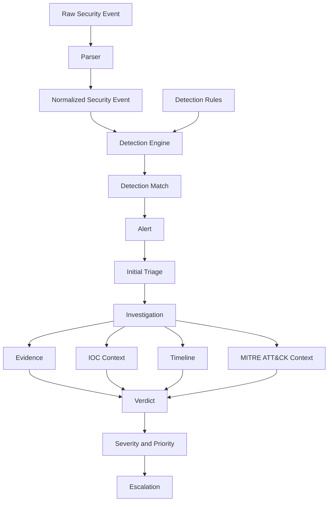

# System Architecture

## Architecture Status

This document describes the planned high-level architecture of SOC Investigation Lab. At the current Project Foundation milestone, engineering infrastructure exists, but the SOC application components described below remain planned. Repository directory names indicate intended responsibilities; their presence does not mean the corresponding functionality is implemented.

The architecture defines conceptual responsibilities and data flow. It does not prescribe low-level classes, database tables, endpoints, or deployment topology.

## Architectural Style

The initial Python backend is planned as a modular monolith: one backend application with clear internal module boundaries and explicit domain responsibilities. Parsing, normalization, detection, alert handling, investigation, enrichment, persistence, and API concerns run within one application rather than as independently deployed services.

This style fits the project's deliberately small scope because it supports easier debugging, deterministic local execution, lower operational complexity, straightforward testing, and direct inspection of security logic. Those qualities are especially valuable for an educational and portfolio project.

The conceptual backend shape is:

```text
Backend application
├── Parsing and normalization
├── Detection
├── Alert handling
├── Investigation
├── Enrichment
├── Persistence
└── API
```

Internal boundaries should remain explicit so responsibilities can be tested independently and refactored later if evidence justifies a different design. The repository currently contains placeholders for these areas, not their implementation.

## High-Level Data Flow

The primary planned pipeline is:

Raw Security Event
→ Source Parser
→ Normalized Security Event
→ Detection Engine
→ Detection Match
→ Alert
→ Initial Triage
→ Investigation
→ Evidence, IOC, Timeline, and MITRE Context
→ Verdict
→ Severity and Priority
→ Escalation



Each source parser reads one supported raw event representation and extracts relevant fields without making detection decisions. Normalization converts parsed data into a source-independent security-event contract. The detection engine evaluates normalized events against transparent rules and emits a detection match when rule conditions are satisfied.

Alert management converts a detection match into analyst-facing work with the event and rule context needed for triage. An investigation then associates related events, evidence, IOCs, timeline entries, and supported MITRE ATT&CK context. The analyst uses that context to record a False Positive or True Positive verdict, assess severity and priority, and prepare escalation information with recommended actions when required.

## Core Domain Objects

The architecture is organized around the following conceptual domain objects. These names describe information responsibilities and do not define implementation classes or storage schemas.

- **Raw Security Event:** source-shaped Windows Event Log or Sysmon telemetry before normalization.
- **Normalized Security Event:** a consistent event representation used by detection and investigation components.
- **Detection Rule:** reviewable detection criteria and descriptive metadata.
- **Detection Match:** evidence that a specific rule matched a normalized event or related event context.
- **Alert:** analyst-facing work created from a detection match, including triage context and lifecycle state.
- **Investigation:** the record that organizes analysis of an alert and its related activity.
- **Evidence:** event-derived facts or analyst-selected observations supporting a decision.
- **IOC Context:** identified indicators and available enrichment relevant to the investigation.
- **Timeline Entry:** a time-ordered activity record used to reconstruct what occurred.
- **MITRE ATT&CK Context:** supported mappings between observed behavior and ATT&CK techniques.
- **Verdict:** the analyst's evidence-based False Positive or True Positive conclusion and rationale.
- **Escalation:** a structured handoff containing priority, severity, evidence, findings, and recommended actions.

## Component Responsibilities

### Telemetry and Datasets

Telemetry inputs provide deterministic Windows Event Log and Sysmon examples for parsing, detection, testing, and investigation scenarios. Initial inputs should be synthetic, sanitized, or generated in a controlled lab and should enter through files, fixtures, or controlled datasets. This component does not provide enterprise-scale collection or live endpoint telemetry.

### Parsers

Parsers understand source-specific event formats, validate required source fields, preserve relevant provenance, and convert raw records into data suitable for normalization. They do not evaluate detection rules, create alerts, or decide investigation outcomes.

### Schemas and Normalization

Schemas define stable contracts for information passed between components. Normalization maps supported source fields into a consistent security-event representation, records source identity, and handles validation failures explicitly. Downstream detection logic should depend on normalized semantics rather than individual raw formats.

### Detection Rules

Detection rules express transparent, reviewable conditions and metadata for suspicious behavior. Rules should remain separate from the evaluation runtime so they can be inspected, versioned, and tested independently. Initial rule content is expected under the Windows rule library.

### Detection Engine

The detection engine loads valid rules, evaluates normalized events deterministically, and produces detection matches with enough rule and event context to explain why a condition matched. It does not own alert workflow, analyst notes, or verdict decisions.

### Alert Management

Alert management turns detection matches into analyst-facing alerts. It owns alert identity, relevant detection context, severity inputs, triage state, and lifecycle transitions required by the alert queue. It should preserve traceability from an alert back to the matching rule and normalized event.

### Investigation

The investigation component organizes alert triage and deeper analysis. It associates related events, evidence, analyst notes, timeline entries, hypotheses, and conclusions with an alert. It coordinates investigation state without embedding source parsing or detection-rule evaluation.

### Enrichment

Enrichment adds investigation context derived from IOCs and supported MITRE ATT&CK mappings. Enrichment results should retain their source and uncertainty, and failures should not erase the underlying evidence. This component supports analyst reasoning; it does not make autonomous containment or verdict decisions.

### Verdict and Escalation

Verdict handling records an evidence-based False Positive or True Positive conclusion, rationale, and final severity and priority assessment. Escalation produces a structured handoff for a higher-tier analyst, including relevant evidence, timeline, IOC and ATT&CK context, findings, and recommended actions.

### Persistence

Persistence stores and retrieves domain information through explicit repository or storage interfaces. It is responsible for data durability and query behavior, not security decisions. The initial architecture does not mandate a particular database technology, distributed storage system, or retention model.

### API

The backend API exposes application operations and validated representations to the analyst interface. It should delegate domain work to the relevant modules, translate transport concerns at the boundary, and avoid duplicating detection or investigation logic in endpoint handlers.

### Analyst Interface

The analyst interface presents alert queues, event context, investigations, evidence, timelines, enrichment, verdicts, and escalation reports. It communicates with the backend API and should not reimplement backend detection or investigation decisions. The interface is planned and is not currently functional.

## Repository Mapping

The intended mapping between architecture responsibilities and repository areas is:

| Repository path | Architectural responsibility | Status |
| --- | --- | --- |
| `datasets/` | Controlled telemetry and reusable dataset inputs | Foundation placeholder |
| `rules/windows/` | Reviewable Windows and Sysmon detection rules | Foundation placeholder |
| `backend/app/parsers/` | Source-specific parsing | Foundation placeholder |
| `backend/app/schemas/` | Input, normalized-event, and boundary contracts | Foundation placeholder |
| `backend/app/detection/` | Rule loading and deterministic evaluation | Foundation placeholder |
| `backend/app/investigation/` | Investigation behavior, evidence, timelines, verdicts, and escalation | Foundation placeholder |
| `backend/app/models/` | Domain and persistence-facing representations | Foundation placeholder |
| `backend/app/services/` | Application-level orchestration across domain responsibilities | Foundation placeholder |
| `backend/app/core/` | Narrow shared configuration and foundational concerns | Foundation placeholder |
| `backend/app/api/` | Backend transport boundary | Foundation placeholder |
| `frontend/` | Analyst-facing web interface | Foundation placeholder |
| `cases/` | Documented investigation scenarios and expected analyst outcomes | Foundation placeholder |
| `tests/fixtures/` | Reusable static test telemetry | Foundation placeholder |
| `tests/integration/` | Cross-component behavior validation | Foundation placeholder |
| `backend/tests/` | Backend unit and lightweight smoke tests | Partially established |
| `docs/` | Architecture, detection, and investigation documentation | Partially established |

These paths express intended ownership. Several currently contain only placeholders and must not be interpreted as implemented modules.

## Component Interaction Rules

- Raw source formats enter through parsers; downstream components consume normalized events.
- Detection rules remain data separate from the engine that evaluates them.
- Detection matches preserve traceability to the responsible rule and supporting event context.
- Alert management consumes detection matches and does not repeat detection evaluation.
- Investigation starts from an alert and may request related events or enrichment through explicit boundaries.
- Evidence remains distinguishable from derived enrichment and analyst conclusions.
- Verdicts and escalations record analyst reasoning; enrichment does not decide them automatically.
- API handlers and the analyst interface delegate domain behavior rather than duplicating it.
- Persistence adapters store domain state without deciding detection, severity, priority, or verdict outcomes.
- Internal dependencies should be explicit, testable, and free of avoidable cycles.
- Failure in optional enrichment should be visible but should not invalidate the original alert or evidence.

## Architecture Boundaries

The backend is not a microservice architecture. The initial design has no service-to-service networking, message broker, event bus, Kubernetes deployment, distributed tracing, internal API gateway, or independently deployed backend units. Those mechanisms would add operational complexity without supporting the current educational and investigation-centered scope.

The architecture also does not extend the project into a full SIEM, EDR, or SOAR platform. It favors explainability, deterministic behavior, reproducible investigations, testability, and maintainability over enterprise ingestion volume, distributed scale, or broad automation.

For the authoritative product boundaries and detailed non-goals, see [Project Scope](../project-scope.md).

Controlled telemetry must not include production credentials, secrets, personal data, or confidential enterprise logs. Security decisions should remain traceable to available evidence and transparent rules.

## Planned Evolution

The architecture is planned to evolve through these roadmap stages:

- **v0.2.x — Event processing and normalization:** introduce supported event parsing, validation, and normalized security-event contracts.
- **v0.3.x — Detection engine and detection rules:** introduce the rule format, rule loading, deterministic evaluation, and the initial Windows rule library.
- **v0.4.x — Alert management:** introduce alert generation, alert models, severity handling, lifecycle state, and the analyst alert queue backend.
- **v0.5.x — Investigation workflow:** introduce triage, related-event analysis, evidence, timelines, analyst notes, verdicts, and escalation workflow.
- **v0.6.x — IOC and MITRE ATT&CK enrichment:** introduce IOC extraction and enrichment, ATT&CK mappings, and supporting investigation context.
- **v0.7.x — Investigation cases:** introduce documented investigation scenarios with evidence, timelines, mappings, verdicts, and escalation reports.
- **v0.8.x — Analyst web interface:** introduce the analyst-facing experience for alerts, investigations, timelines, IOC context, verdicts, and reports.

These entries are planned architecture stages, not statements that the corresponding versions or capabilities have already been released. Testing, validation, and documentation should evolve alongside each capability.

Module boundaries may be refined as concrete requirements emerge. A distributed design should be considered only if measured constraints justify it; future refactoring should not be driven by speculative scale. Until then, the modular monolith remains the planned deployment and development model.

